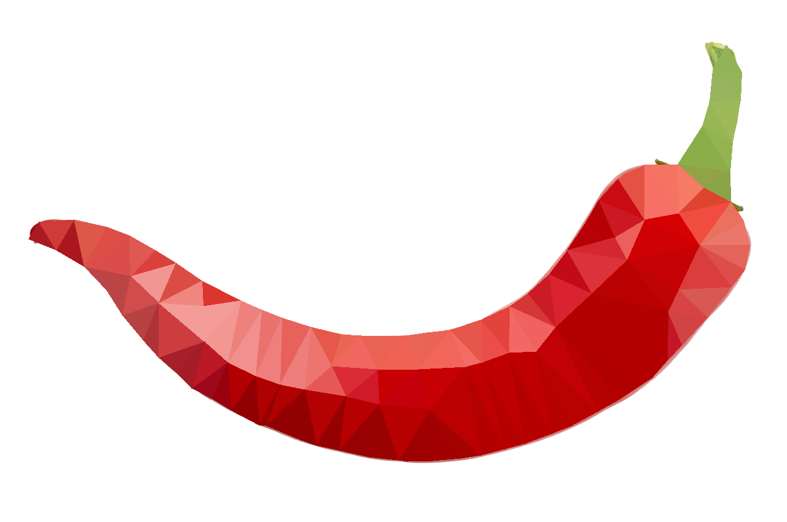

# Lowpoly

This is a script to generate lowpoly of a image. Two version are available, local python script and a web version. Python version has a option to use entropy method which is slow to calculate on the browser.

## Showcase
| Original | Lowpoly |
|----------|---------|
|||
|||

## How to Run the Python Script

- **Clone the repo**
    ```
    git clone https://github.com/kapilpokhrel/Lowpoly.git
    cd Lowpoly
    ```
- **Install dependencies**
    ```
    pip install -r requirements.txt
    ```
- **Run the Script**
    ```
    python lowpoly.py dogimage.jpg
    ```
    For command line options, run
    ```
    python lowpoly.py --help
    ```

## Why?

Because, one day I saw a Desmos art which made cool image by using polygons and I wanted to generate a lowpoly image made up of polygons in a desmos graph and it was quite a challenge. Later, I realized that have it generate only in desmos was kinda weird and changed it to generate a image. But still, there's a brach named desmos with old code.

## ~~Why Python script instead of just using Javascript?~~

~~I know its tedious to clone the repo and install all dependencies. But here are some reasons I chose python:~~
- ~~I did write it in Javascript to check but calculating entropy of a image was way too slow and I couldn't find any faster way to do it in JS.~~
- ~~It's easy with everything already done for you by python packages.:grin:~~

While all this is still true, there's now a web version but only sobel filter method is implemented.

----
Huge thanks to these posts:
- http://www.degeneratestate.org/posts/2017/May/24/images-to-triangles/
- https://esimov.com/2019/04/image-triangulation-in-go
